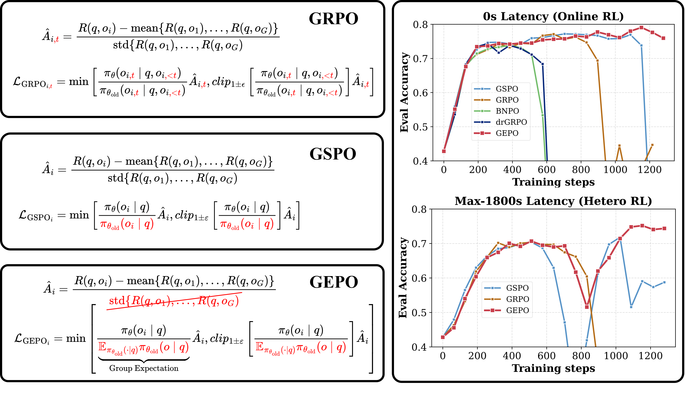

# ✨ HeteroRL: Heterogeneous Reinforcement Learning

> **Paper**: [GEPO: Group Expectation Policy Optimization for Heterogeneous Reinforcement Learning](https://arxiv.org/abs/2508.17850)  
> **Codebase**: Built on [`trl`](https://github.com/huggingface/trl) & [`open-r1`](https://github.com/huggingface/open-r1)


<details open>
<summary>📢 <strong> BREAKING: GEPO — The Algorithm That Makes Decentralized AI Training Possible!</strong></summary>

<br>

<h2 align="center">✨ GEPO: Group Expectation Policy Optimization for Heterogeneous RL</h2>

📅 **Release**: Aug 25, 2025 (arXiv)  
📄 **Paper**: [Group Expectation Policy Optimization for Heterogeneous Reinforcement Learning](https://arxiv.org/abs/XXXX.XXXXX)  
🧑‍💻 **Authors**: Han Zhang, Ruibin Zheng, et al. (Pengcheng Lab / Heterogeneous Large Model Research Team)  
🔗 **Code**: [https://github.com/HanlardResearch/HeteroRL_GEPO.git](https://github.com/HanlardResearch/HeteroRL_GEPO.git)

---

### ⚡ Why It Matters

Training giant AI models now requires global, decentralized compute. But network delays cause “policy staleness,” making traditional RL algorithms (like GRPO, GSPO) **crash** due to exploding gradient variance.

**GEPO solves this.** By replacing unstable per-token weights with **Group Expectation Importance Weighting**, it exponentially reduces variance under high latency — enabling stable training even with **1800-second delays**.

✅ **Theoretically Proven**: Exponentially reduces importance sampling variance (Theorem 1).  
✅ **Extremely Robust**: Only **3% performance drop** under extreme 1800s latency.  
✅ **Plug-and-Play**: Easy to integrate — modifies only the importance weight calculation.  
✅ **Better Everywhere**: Outperforms GRPO/GSPO even in zero-delay (online) settings.

> 📊 **Key Results (Qwen3-1.7B)**:
> - **Zero-Delay**: GEPO Last = **41.4** vs. GSPO Last = **24.3** (+17.1 gain).  
> - **High-Delay (64 steps)**: GEPO Last = **43.5** (no drop) vs. GSPO Last = **20.9**.  
> - **Extreme Test (1800s)**: Performance degradation **< 3%**.

---

### 🧠 The Core Idea: Think Groups, Not Tokens

Traditional methods use `p(y|x) / q(y|x)`, which explodes when `q(y|x)` is small. GEPO’s genius is simple:

**Group Expectation Weight:**
`w_GEPO(y|x) = p(y|x) / Ê_q[q(y|x)]`

Where `Ê_q[q(y|x)]` is estimated from a group of responses `{y1...yG}` for the same prompt `x`:
`Ê_q[q(y|x)] ≈ Σ(q(yi|x)²) / Σ(q(yi|x))`

This group-level denominator **smooths out wild fluctuations**, preventing gradient explosions and keeping training stable — no matter how stale the data is.



> **Figure 1**: GEPO improves upon GRPO and GSPO by employing **group-level importance weights** to enhance training stability. It demonstrates superior performance in both **zero-delay (online)** and **high-delay (up to 1800s)** heterogeneous RL scenarios.

---

### 🚀 The Future: Decentralized AI is Here

GEPO is the engine of **HeteroRL**, a framework that decouples sampling and learning across global nodes. This isn’t just an algorithm — it’s the foundation for community-driven, globally distributed AI training.

> 💡 **Pro Tip**:  
> - Use GEPO as your **default RL algorithm** — it’s more stable everywhere.  
> - For maximum robustness in production, combine it with the “Defensive Sampling” mechanism (Appendix F).

</details>

---

## 📰 Latest Update: ∆L Normalization Integrated into HeteroRL!

<details open>
<summary>📢 <strong> Update: Added Implementation of ∆L Normalization — Unbiased & Minimum-Variance!</strong></summary>

<br>

<h2 align="center">✨ ∆L Normalization: Rethink Loss Aggregation in RLVR</h2>

📅 **Release Date**: Sep 9, 2025 (arXiv)  
📄 **Paper**: [∆L Normalization: Rethink Loss Aggregation in RLVR](https://arxiv.org/abs/2509.07558)  
🧑‍💻 **Authors**: Zhiyuan He, Xufang Luo (Microsoft Research), Yike Zhang (Tsinghua), et al.  
🔗 **Implementation**: Based on [Delta-L-Normalization](https://github.com/zerolllin/Delta-L-Normalization)

---

### ⚡ Why It Matters
In RLVR, response lengths vary dramatically — leading to **high gradient variance** and **biased updates** in existing methods (GRPO, DAPO, Dr. GRPO).  
∆L Normalization solves both:
✅ **Unbiased estimator** of true policy gradient  
✅ **Theoretically minimal variance** (when `α=1`)  
✅ **Plug-and-play** — <10 lines to integrate

> 💡 **Pro Tip**:  
> - Use `α=1` for **minimum variance** (default, stable training).  
> - Use `α=0.75` for **Math tasks** — better utilization of long, informative responses.

</details>


<details>
<summary>📢 <strong>Update: Added Implementation of GSPO — Stable, Efficient & MoE-Friendly!</strong></summary>

<br>

<h2 align="center">✨ GSPO: Group Sequence Policy Optimization for Scalable RL</h2>

📅 **Release Date**: July 28, 2025 (arXiv v2)  
📄 **Paper**: [**Group Sequence Policy Optimization**](https://arxiv.org/abs/2507.18071)  
🧑‍💻 **Authors**: Chujie Zheng, Shixuan Liu, Mingze Li, Bowen Yu, et al. (Qwen Team, Alibaba)  

---

### ⚡ Why It Matters
Existing methods like **GRPO** suffer from **catastrophic instability** when scaling to large models — especially **MoE architectures** — due to noisy token-level importance ratios.  
**GSPO fixes this at the root**:
✅ **Sequence-level importance weights** — Matches reward granularity & reduces variance  
✅ **Stable MoE training** — No “Routing Replay” hacks needed 🚫  
✅ **Higher training efficiency** — Achieves better performance with same compute  
✅ **Simpler infrastructure** — Compatible with inference-engine likelihoods (no recompute needed)

> 💡 **Pro Tip**:  
> - Use `clip_range=(3e-4, 4e-4)` for optimal stability (default in Qwen3 RL training).  
> - For multi-turn RL, try **GSPO-token** variant — enables per-token advantage while preserving sequence-level stability.

</details>


<details>
<summary>📢 <strong>Update: Added Implementation of Dr. GRPO — Unbiased & Token-Efficient!</strong></summary>

<br>

<h2 align="center">✨ Dr. GRPO: Group Relative Policy Optimization Done Right</h2>

📅 **Release Date**: March 26, 2025 (arXiv)  
📄 **Paper**: [**Understanding R1-Zero-Like Training: A Critical Perspective**](https://arxiv.org/abs/2503.20783)  
🧑‍💻 **Authors**: Zichen Liu, Changyu Chen, Wenjun Li, et al. (Sea AI Lab, NUS, SMU)

---

### ⚡ Why It Matters
Original **GRPO** introduces **length bias** and **difficulty bias** — artificially inflating response lengths (especially for *incorrect* answers) and skewing updates toward “easier” questions.  
**Dr. GRPO removes these biases at the source**:
✅ **Unbiased gradient estimator** — Faithfully implements true policy gradient objective  
✅ **Token-efficient training** — Prevents wasteful generation of long, incorrect responses 🚫📏  
✅ **Plug-and-play replacement** — Drop-in substitute for GRPO with minimal code change  
✅ **Preserves reasoning performance** — Matches or exceeds GRPO’s final accuracy with less compute

> 💡 **Pro Tip**:  
> - Use Dr. GRPO when you want **stable length growth** (only for correct reasoning, not noise).  
> - Combine with **∆L Normalization** for double variance reduction + unbiasedness.

</details>

<details>
<summary>📢 <strong>Update: Added Implementation of BNPO — Adaptive, Low-Variance & Generalizes GRPO!</strong></summary>

<br>

<h2 align="center">✨ BNPO: Beta Normalization Policy Optimization for Stable RL Training</h2>

📅 **Release Date**: June 3, 2025 (arXiv)  
📄 **Paper**: [**BNPO: Beta Normalization Policy Optimization**](https://arxiv.org/abs/2506.02864)  
🧑‍💻 **Authors**: Changyi Xiao, Mengdi Zhang, Yixin Cao (Fudan University, Meituan)  

---

### ⚡ Why It Matters
Current RL methods like **GRPO** and **REINFORCE** use **static reward normalization** — fixed throughout training — which fails to adapt to the evolving policy distribution, leading to unstable gradients and suboptimal convergence.  
**BNPO solves this with dynamic, theoretically grounded normalization**:
✅ **Adaptive Beta normalization** — Parameters `(α, β)` update dynamically with policy evolution  
✅ **Proven variance reduction** — Theoretically minimizes gradient variance under binary rewards  
✅ **Generalizes GRPO & REINFORCE** — Reduces to them under specific `(α, β)` settings  
✅ **Handles complex rewards** — Via novel *Advantage Decomposition* mechanism

> 💡 **Pro Tip**:  
> - BNPO automatically sets `α = (1+a)/3`, `β = (1+b)/3` — no manual tuning needed.  
> - Use Advantage Decomposition when combining multiple reward signals (e.g., accuracy + format).

</details>


---


## 🧠 Importance Weight Computation (Policy Optimization Methods)

```python
# Token-level importance ratio (e.g., GRPO, Dr. GRPO, BNPO)
if self.loss_type in ["grpo", "dr_grpo", "bnpo"]:
    coef_1 = learner_token_p / sampler_token_p

# Sequence-level importance ratio (GSPO)
elif self.loss_type == "gspo":
    coef_1 = learner_seq_p / sampler_seq_p

# Group-level importance ratio (GEPO — Ours)
elif self.loss_type == "gepo":
    normalized_q = sampler_seq_p.detach() / sampler_seq_p.sum().detach()
    coef_1 = learner_seq_p / (normalized_q * sampler_seq_p).sum()
```

> 📌 **Note**: GEPO computes importance weights at the **group level**, stabilizing training under heterogeneous sampling delays.

---

## ⚙️ Heterogeneous Reinforcement Learning Setup

> 📁 Enter the project directory first. Adjust paths in scripts if your directory differs.

### 1️⃣ Launch the Learner (4×A100 80GB)

```bash
cd ./open-r1
CUDA_VISIBLE_DEVICES=0,1,2,3 bash sh_dir/HeteroRL_Learner_4gpus.sh learner_script_checkpoint GEPO_think_1th 1 v6b gepo 1L2S_GEPO_diff32_think
```

### 2️⃣ Launch Samplers (Run in Sequence)

> 🔄 To resume from checkpoint: Set `model_name_or_path` to your checkpoint path.

```bash
# Launch 4 sampler processes in background
bash sh_dir/HeteroRL_Sampler_4gpus.sh sampler_script_checkpoint GEPO_think_1th v6b gepo 1L2S_GEPO_diff32_think 0 &
bash sh_dir/HeteroRL_Sampler_4gpus.sh sampler_script_checkpoint GEPO_think_1th v6b gepo 1L2S_GEPO_diff32_think 1 &
bash sh_dir/HeteroRL_Sampler_4gpus.sh sampler_script_checkpoint GEPO_think_1th v6b gepo 1L2S_GEPO_diff32_think 2 &
bash sh_dir/HeteroRL_Sampler_4gpus.sh sampler_script_checkpoint GEPO_think_1th v6b gepo 1L2S_GEPO_diff32_think 3 &
```

---

## 🌐 Online Reinforcement Learning (4×A100 80GB)

Supports multiple loss types:
- [`grpo`](https://arxiv.org/abs/2402.03300)
- [`bnpo`](https://arxiv.org/abs/2506.02864)
- [`dr_grpo`](https://arxiv.org/abs/2503.20783)
- [`gspo`](https://arxiv.org/abs/2507.18071)
- [`∆L Norm`](https://arxiv.org/abs/2509.07558)
- **`gepo` (ours)** 👈

```bash
cd ./open-r1
CUDA_VISIBLE_DEVICES="0,1,2,3" MASTER_PORT=29510 bash sh_dir/Online_gXpo_4gpus.sh gepo
```

---

## 📚 Citation

If you use **GEPO** or find this code helpful, please cite:

```bibtex
@misc{gepo2025,
  title     = {Group Expectation Policy Optimization for Heterogeneous Reinforcement Learning},
  author    = {Han Zhang and Ruibin Zheng and Zexuan Yi and Zhuo Zhang and Hanyang Peng and Hui Wang and Zike Yuan and Cai Ke and Shiwei Chen and Jiacheng Yang and Yangning Li and Xiang Li and Jiangyue Yan and Yaoqi Liu and Liwen Jing and Jiayin Qi and Ruifeng Xu and Binxing Fang and Yue Yu},
  year      = {2025},
  eprint    = {2508.17850},
  archivePrefix = {arXiv},
  primaryClass = {cs.LG},
  url       = {https://arxiv.org/abs/2508.17850}
}
```

